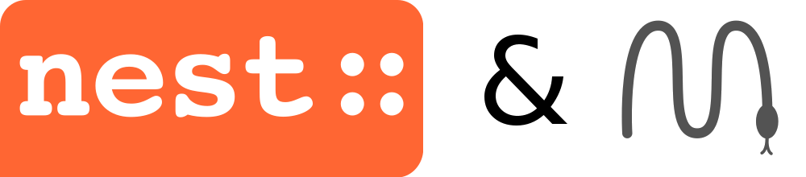

# Introduction to the simulation of structurally detailed large-scale neuronal networks

Tutorial at CNS 2019 in Barcelona.

Tutors: Alexander van Meegen, Dennis Terhorst

## Schedule

### PART I / Morning

* Introduction (AvM & DT)

* NEST Introduction (DT)
  * NEST background presentation
  * unsynchronized troubleshooting and Jupyter notebook examples
  * re-synchronized Brunel-Notebook presentation

* Snakemake Introduction (AvM)
  * short presentation
  * unsynchronized Brunel-Workflow tasks
  * re-synchronized Brunel-Workflow solutions

### PART II / Afternoon

* Multi-area-networks Introduction
  * short motivation (AvM)
  * short HPC outlook (DT)
  * unsynchronized workflow / script building
  * additional: unsynchronized HPC

* Advanced NEST & Outro (AvM & DT)

## Installation

We recommend using a conda environment to get all necessary dependencies.
After [installing conda](https://conda.io/docs/user-guide/install/index.html) create a new environment and activate it:
```
conda env create -f environment.yml
conda activate CNS2019_NEST
```

If nest is not found in jupyter notebooks reinstall the correct python kernel for the notebooks:
```
python -m ipykernel install --prefix $CONDA_PREFIX
```

## Acknowledgements

This tutorials extensively makes use of previous NEST tutorials by
* Hannah Bos
* David Dahmen
* Moritz Deger
* Jochen Martin Eppler
* Espen Hagen
* Abigail Morrison
* Jannis Schuecker
* Johanna Senk
* Tom Tetzlaff
* Sacha van Albada
