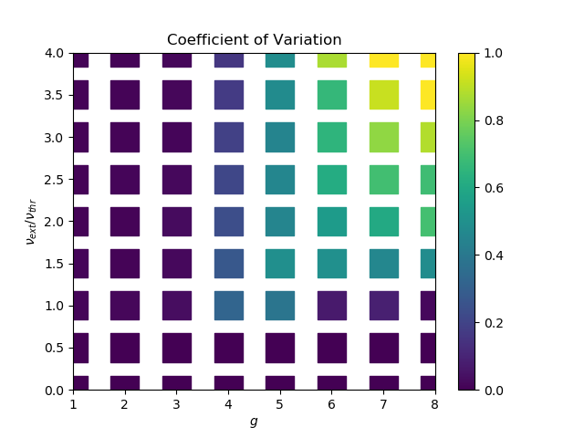

# Snakemake tutorial

A short introduction to [snakemake](https://snakemake.readthedocs.io/en/stable/)
based on a parameter scan of the Brunel network. Final result:

## Tasks

* understand the `Snakefile`
  * compare to the visualization `graph.png`
  * produce the visualization yourself: `snakemake --dag | dot | display`
  * make a dry-run: `snakemake -np`
  * understand the interplay of the `Snakefile` and `config.yaml`
* produce a first version of the phase diagram
  * execute the workflow: `snakemake`
  * have a look at the phase diagram
* extend the phase diagram a bit
  * extend the parameter range using `config.yaml`
  * make a dry-run: `snakemake -np`
  * why did nothing happen?
  * force the execution: `snakemake -f plotPhaseDiagram -np`
  * run using multiple threads: `snakemake -f plotPhaseDiagram --cores 3`
* let's stop using a downscaled network and a rather short simulation time
  * understand the `N_scale` options: `python scripts/simulateBrunel.py --help`
  * add an `N_scale` parameter to the Snakefile and pass it as an argument
  * repeat the same with the `simtime`
  * play around a bit and see how it affects the statistics
  * does the rate change with `N_scale`? why / why not?
* run a full scan of the parameter regime
  * change `config.yaml` to `config_full.yaml`
  * use multiple cores to simulate multiple parameter sets in parallel
  * go grab a coffee, do something fun, or advance to the next task
* let's think about a more modular implementation of `simulateBrunel.py`
  * look at `simulateBrunelModular.py` and decide for yourself if this is cleaner
  * besides code structure, why could this implementation be useful?

## Files

* `brunel_parameters.yaml`: parameter file containing all network parameters
* `config.yaml`: configuration file for the snakemake worflow
* `config_full.yaml`: configuration file for the snakemake worflow corresponding to the above figure
* `graph.png`: visualization of the snakemake workflow
* `Snakefile`: snakemake workflow file
* `scripts/simulateBrunel.py`: script to simulate a Brunel network (naive implementation)
* `scripts/simulateBrunelModular.py`: script to simulate a Brunel network (modular implementation)
* `scripts/plotPhaseDiagram.py`: script to plot the phase diagram of the Brunel network

## Useful snakemake options

* execute using default settings: `snakemake`
* list all rules: `snakemake -l`
* summarize workflow output status: `snakemake -S`
* dry-run mode, print bash commands: `snakemake -np`
* visualize workflow: `snakemake --dag | dot | display`
* execute a specific rule: `snakemake plotPhaseDiagram`
* force execution of a specific rule: `snakemake -f plotPhaseDiagram`
* specify config file: `snakemake --configfile config_full.yaml`
* use multiple threads: `snakemake --cores 3`
